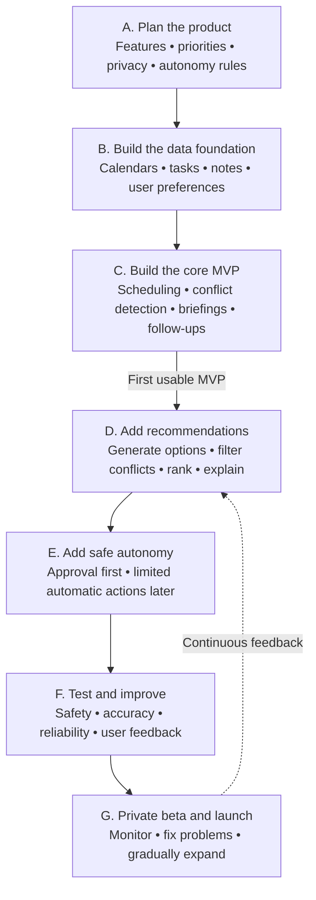

# AI Secretary — Living Project Plan

This file is the project's editable source of truth. It records the agreed direction, current phase, open decisions, and completion gates. Update it whenever a decision changes or a phase is completed.

**Status:** Phase A — Plan the product

**Last updated:** 2026-07-21

**Current deliverable:** Product contract for the first usable version

## Product vision

Create one AI secretary that helps manage school, work, and personal life while preserving separate privacy boundaries for each domain.

The secretary should turn commitments into an understandable, reversible loop:

> Capture → understand → recommend → approve or act → monitor → alert → follow up → learn

## Agreed product principles

- Serve school, work, and personal life through one shared planning engine.
- Keep the source, domain, and privacy level attached to every event, task, note, and recommendation.
- Treat permissions and hard calendar constraints as absolute; recommendation scores cannot override them.
- Start with approval-based actions and introduce narrow, reversible autonomy later.
- Explain why each recommendation was made and what trade-off it creates.
- Keep an audit history and an undo path for every calendar-changing action.
- Use AI for interpretation, extraction, summarization, and explanations—not as the final authority for permissions or calendar writes.

## Development pipeline

## Phase tracker

| Phase | Outcome | Status |
|---|---|---|
| A. Plan the product | Approved product contract and scope | **In progress** |
| B. Build the data foundation | Trusted, read-only unified data model | Not started |
| C. Build the core MVP | First complete secretary loop | Not started |
| D. Add recommendations | Explainable next-action recommendations | Not started |
| E. Add safe autonomy | Guarded, reversible automatic actions | Not started |
| F. Test and improve | Validated safety, accuracy, and reliability | Not started |
| G. Private beta and launch | Monitored release with gradual expansion | Not started |

## Phase A — Plan the product

### Goal

Agree on exactly who the first version serves, what it must do, what it must not do, how recommendations behave, and which actions require approval.

### Already agreed

- Version 1 is a private, single-user assistant for June74, designed so it can expand later.
- Version 1 starts as a web app with conversational chat and a Today dashboard.
- Downloadable mobile and desktop clients are a later distribution target.
- Future desktop clients support optional launch at login and on-cue access; mobile clients use on-cue access and notifications.
- The secretary covers school, work, and personal life.
- The core MVP collects calendar events, tasks, and notes.
- Users can request scheduling changes conversationally.
- The assistant detects conflicts and protects stated priorities.
- It produces morning and evening briefings.
- It extracts and tracks meeting decisions and follow-ups.
- It includes a recommendation system for next actions, preparation, schedule repair, and protected time.
- It supports autonomy levels rather than a single all-or-nothing permission setting.

### Decisions to make

- First user and release audience
- First calendar provider and capture sources
- Domain and cross-domain privacy rules
- Priority and conflict-resolution behavior
- Recommendation categories and ranking principles
- Alert channels and notification limits
- Autonomy boundaries by action type
- MVP success measures
- Explicit non-goals for the first release

### Phase A completion checklist

- [x] Select the first user and release audience: June74 only for version 1.
- [x] Select the primary interaction surface: web app with chat and a Today dashboard.
- [x] Define future client activation: optional desktop auto-start plus on-cue access; mobile on-cue access and notifications.
- [ ] Define the first provider and supported input sources.
- [ ] Define the canonical product objects: event, task, note, commitment, recommendation, preference, policy, and audit event.
- [ ] Define cross-domain visibility and privacy behavior.
- [ ] Define priority and conflict-resolution rules.
- [ ] Define recommendation categories, evidence, feedback, and ranking contract.
- [ ] Define autonomy levels and always-confirm actions.
- [ ] Define alerts, briefings, and notification limits.
- [ ] Write representative school, work, personal, and cross-domain scenarios.
- [ ] Define measurable MVP acceptance criteria.
- [ ] Record first-release non-goals.
- [ ] Review and approve the completed product contract.

## Preliminary MVP boundary

### Include

- One private user: June74
- Web app with conversational chat and a Today dashboard
- One calendar provider with separate school, work, and personal calendars
- Text capture for tasks, commitments, and pasted notes
- Proposed calendar changes with approval and undo
- Conflict and protected-time detection
- Morning and evening briefings
- Meeting decision and follow-up extraction
- Explainable schedule and next-action recommendations
- In-app alerts, with additional channels decided during Phase A

### Defer

- Autonomous communication or negotiation with attendees
- Meeting recording and transcription
- Purchases, reservations, and travel booking
- Team or shared-secretary workflows
- Multiple calendar providers
- Native mobile and desktop application packaging
- Unrestricted background autonomy
- A recommendation model trained across users

### Future distribution target

- Provide downloadable mobile and desktop clients after the web MVP is validated.
- Reuse the same secretary backend, policies, and synchronized data across every client.
- Let desktop users optionally launch the client at login while retaining voice, hotkey, and icon cues.
- Use on-cue access and notifications on mobile rather than requiring continuous background operation.

## Decision log

| Date | Decision | Reason | Status |
|---|---|---|---|
| 2026-07-21 | Future clients combine optional desktop launch at login with on-cue access; mobile uses on-cue access and notifications. | This keeps the secretary readily available without requiring continuous background activity on every device. | Agreed |
| 2026-07-21 | Start version 1 as a web app with chat and a Today dashboard; add downloadable mobile and desktop clients later. | A web foundation reaches the first usable version sooner while keeping the core experience portable to future clients. | Agreed |
| 2026-07-21 | Version 1 serves June74 only, while preserving a path to future expansion. | A private single-user release reduces authentication, tenancy, privacy, and onboarding scope while the core secretary loop is validated. | Agreed |
| 2026-07-21 | Serve school, work, and personal life in one product. | The secretary should coordinate the user's whole schedule. | Agreed |
| 2026-07-21 | Use autonomy levels. | Different actions carry different risk and should not share one permission switch. | Agreed |
| 2026-07-21 | Add an explainable recommendation system. | The secretary should proactively suggest useful next actions and schedule improvements. | Agreed |
| 2026-07-21 | Build an approval-based core MVP before guarded autonomy. | Trust, reversibility, and observable behavior come before automatic execution. | Agreed |

## Change policy

When this plan changes:

1. Update the relevant section.
2. Add or revise a decision-log entry when the change affects product behavior or scope.
3. Update the phase status and checklist.
4. Do not silently replace an agreed rule; mark it as superseded and record why.
