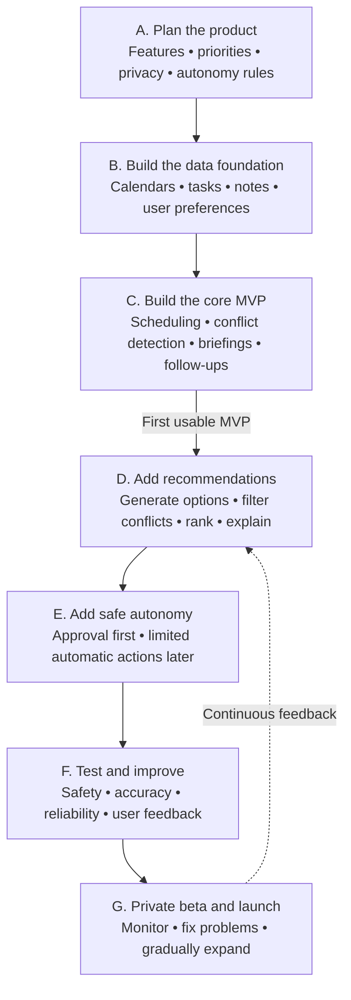

# AI Secretary — Living Project Plan

This file is the project's editable source of truth. It records the agreed direction, current phase, open decisions, and completion gates. Update it whenever a decision changes or a phase is completed.

**Status:** Phase A — Plan the product

**Last updated:** 2026-07-21

**Current deliverable:** Product contract for the first usable version

## Product vision

Create one AI secretary that helps manage school, work, and personal life while preserving separate privacy boundaries for each domain.

The secretary should turn commitments into an understandable, reversible loop:

> Capture → understand → recommend → approve or act → monitor → alert → follow up → learn

## Agreed product principles

- Serve school, work, and personal life through one shared planning engine.
- Keep the source, domain, and privacy level attached to every event, task, note, and recommendation.
- Share planning facts across domains by default while keeping detailed content separated unless the user explicitly links it.
- Treat permissions and hard calendar constraints as absolute; recommendation scores cannot override them.
- Let quiet-hours alerts through only for user-marked critical items or verified imminent risk to a fixed commitment or hard deadline.
- Rank only feasible flexible items contextually; do not give school, work, or personal items a permanent default advantage.
- Keep version 1 recommendations secretary-focused rather than mixing in broad commercial or entertainment discovery.
- Start with approval-based actions and introduce narrow, reversible autonomy later.
- Explain why each recommendation was made and what trade-off it creates.
- Keep an audit history and an undo path for every calendar-changing action.
- Use AI for interpretation, extraction, summarization, and explanations—not as the final authority for permissions or calendar writes.

## Development pipeline

## Phase tracker

| Phase | Outcome | Status |
|---|---|---|
| A. Plan the product | Approved product contract and scope | **In progress** |
| B. Build the data foundation | Trusted, read-only unified data model | Not started |
| C. Build the core MVP | First complete secretary loop | Not started |
| D. Add recommendations | Explainable next-action recommendations | Not started |
| E. Add safe autonomy | Guarded, reversible automatic actions | Not started |
| F. Test and improve | Validated safety, accuracy, and reliability | Not started |
| G. Private beta and launch | Monitored release with gradual expansion | Not started |

## Phase A — Plan the product

### Goal

Agree on exactly who the first version serves, what it must do, what it must not do, how recommendations behave, and which actions require approval.

### Already agreed

- Version 1 is a private, single-user assistant for June74, designed so it can expand later.
- Version 1 starts as a web app with conversational chat and a Today dashboard.
- Downloadable mobile and desktop clients are a later distribution target.
- Future desktop clients support optional launch at login and on-cue access; mobile clients use on-cue access and notifications.
- Google Calendar is the first calendar provider for version 1.
- Long-term calendar coverage includes calendars created in supported providers and calendars created directly inside Vision.
- Version 1 accepts chat messages, pasted text, and document or image uploads; email and voice capture follow later.
- Version 1 delivers in-app and browser or push alerts with urgency levels, configurable quiet hours, and morning and evening digests; SMS and email delivery follow later.
- The secretary covers school, work, and personal life.
- The core MVP collects calendar events, tasks, and notes.
- Users can request scheduling changes conversationally.
- The assistant detects conflicts and protects stated priorities.
- It produces morning and evening briefings.
- It extracts and tracks meeting decisions and follow-ups.
- It includes a recommendation system for next actions, preparation, schedule repair, and protected time.
- It supports autonomy levels rather than a single all-or-nothing permission setting.

### Decisions to make

- Notification rate limits and repeated-alert escalation
- Autonomy boundaries by action type
- MVP success measures
- Explicit non-goals for the first release

### Phase A completion checklist

- [x] Select the first user and release audience: June74 only for version 1.
- [x] Select the primary interaction surface: web app with chat and a Today dashboard.
- [x] Define future client activation: optional desktop auto-start plus on-cue access; mobile on-cue access and notifications.
- [x] Select the first calendar provider: Google Calendar.
- [x] Define the long-term calendar target: provider-created calendars plus Vision-native calendars.
- [x] Define the initial non-calendar capture sources: chat, pasted text, and document or image uploads.
- [ ] Define the canonical product objects: event, task, note, commitment, recommendation, preference, policy, and audit event.
- [x] Define cross-domain visibility and privacy behavior: shared planning facts, separated detailed content, and explicit reversible links.
- [x] Define priority and conflict-resolution rules: hard constraints first, then context-aware proposals for flexible items.
- [x] Define recommendation categories, evidence, feedback, and ranking contract for the secretary-focused version 1 scope.
- [ ] Define autonomy levels and always-confirm actions.
- [x] Define version 1 alert channels and briefing cadence: in-app plus browser or push alerts, with morning and evening digests.
- [x] Define quiet-hours exceptions: user-marked critical items or verified imminent risk to a fixed commitment or hard deadline.
- [ ] Define notification rate limits and repeated-alert escalation.
- [ ] Write representative school, work, personal, and cross-domain scenarios.
- [ ] Define measurable MVP acceptance criteria.
- [ ] Record first-release non-goals.
- [ ] Review and approve the completed product contract.

### Cross-domain privacy model

- Use one shared planner for school, work, and personal scheduling.
- Share availability, deadlines, priority, duration, flexibility, location or travel needs, and protected-time status with the planner by default.
- Keep note bodies, attachments, event descriptions, meeting details, and other sensitive content inside their original domain by default.
- Allow the user to create explicit, inspectable, and reversible links when detailed information should cross domains.
- Reveal only the minimum necessary information in external actions; for example, say the user is unavailable without exposing a private event title.
- Preserve source, domain, privacy level, and permission provenance on every derived item.

### Priority and conflict-resolution model

- Reject any option that violates permissions, privacy rules, immovable events, travel feasibility, hard deadlines, or time the user marked non-negotiable.
- Rank only the remaining flexible options using user-stated importance, urgency and deadline risk, protected-time impact, preparation value, schedule fit, and disruption to accepted plans.
- Do not impose a fixed school-over-work-over-personal hierarchy.
- Present the recommended option, the reasons it ranked highest, the trade-off it creates, and at least one feasible alternative when available.
- Ask the user before resolving a materially uncertain or high-impact trade-off.
- Allow later feedback to tune preference-sensitive ranking without weakening hard constraints.

### Recommendation system version 1 contract

Version 1 may recommend:

- Creating, moving, splitting, or repairing schedule blocks
- The next task to work on
- Meeting and event preparation
- Follow-ups and unfulfilled commitments
- Conflict-resolution options
- Focus time and protected personal time
- Deadline-risk and insufficient-preparation warnings

Every recommendation must:

- Link to the source facts that triggered it.
- Pass privacy, permission, and hard-constraint filters before ranking.
- Use the context-aware priority model only to order feasible actions.
- State the proposed action, why it matters now, its trade-off, confidence, and approval requirement.
- Offer a feasible alternative when one exists.
- Expire or be recomputed when its source state changes.

Feedback distinguishes accept, edit, dismiss, snooze, undo, and eventual completion. Explicit corrections outweigh inferred behavior, and ignoring a suggestion does not automatically mean rejection. Initial ranking remains inspectable and rules-based; numerical weights are product hypotheses until evaluated. A recommendation never executes directly and must pass through the separate autonomy gate.

## Preliminary MVP boundary

### Include

- One private user: June74
- Web app with conversational chat and a Today dashboard
- Google Calendar as the first provider, with the exact calendars selected during onboarding
- Chat and pasted-text capture for tasks, commitments, and notes
- Document and image uploads
- Cross-domain planning with domain-separated detailed content
- Proposed calendar changes with approval and undo
- Conflict and protected-time detection
- Context-aware conflict proposals with explanations and feasible alternatives
- Morning and evening briefings
- Meeting decision and follow-up extraction
- Explainable secretary-focused recommendations for scheduling, next tasks, preparation, follow-ups, protected time, and deadline risk
- In-app and browser or push alerts with urgency levels, configurable quiet hours, and morning and evening digests

### Defer

- Autonomous communication or negotiation with attendees
- Meeting recording and transcription
- Email ingestion and voice capture or commands
- SMS and email alert delivery
- Purchases, reservations, and travel booking
- Team or shared-secretary workflows
- Multiple calendar providers and Vision-native user-created calendars
- Native mobile and desktop application packaging
- Unrestricted background autonomy
- A recommendation model trained across users
- Broad discovery recommendations for activities, venues, products, courses, entertainment, or purchases

### Future distribution target

- Provide downloadable mobile and desktop clients after the web MVP is validated.
- Reuse the same secretary backend, policies, and synchronized data across every client.
- Let desktop users optionally launch the client at login while retaining voice, hotkey, and icon cues.
- Use on-cue access and notifications on mobile rather than requiring continuous background operation.

### Future calendar expansion target

- Expand beyond Google Calendar after the first provider integration is validated.
- Include every calendar the user selects from each supported external provider, including calendars the user created there.
- Allow the user to create and manage calendars directly inside Vision.

### Future capture expansion target

- Add email ingestion after the initial text and file capture flow is reliable.
- Add voice notes and voice commands for on-cue interaction after the web MVP.
- Keep meeting recording and transcription separate because they require additional consent and privacy controls.

### Alert delivery roadmap

- Use in-app and browser or push notifications in version 1.
- Support user-configurable quiet hours and notification categories.
- Deliver morning and evening digests for non-immediate planning information.
- Apply the cross-domain privacy model to notification previews and reveal only necessary details.
- Add SMS and email delivery after the initial notification system is reliable.
- Define rate limits and repeated-alert escalation separately before completing the alert policy.

### Quiet-hours exception contract

- Suppress ordinary alerts and recommendations during the user's configured quiet hours.
- Allow an interruption only when the user explicitly marked the item critical or Vision verifies an imminent risk of missing a fixed commitment or hard deadline.
- Do not let a recommendation score, inferred importance, or AI-generated urgency label qualify by itself.
- Use deterministic, user-configurable timing rules to define the imminent window rather than an unconstrained model judgment.
- Let the user disable all quiet-hours overrides.
- Log why each interruption qualified and retain only the minimum details needed in its notification preview.

## Decision log

| Date | Decision | Reason | Status |
|---|---|---|---|
| 2026-07-21 | Allow quiet-hours interruptions only for user-marked critical items or verified imminent risk to a fixed commitment or hard deadline. | This protects rest while still surfacing the narrow set of alerts whose delay could cause a concrete missed obligation. | Agreed |
| 2026-07-21 | Use in-app and browser or push alerts with urgency levels, quiet hours, and morning and evening digests in version 1; add SMS and email later. | This provides timely web-first alerts without making the initial release depend on phone-number or email-delivery infrastructure. | Agreed |
| 2026-07-21 | Limit version 1 to secretary-focused recommendations. | Scheduling, next tasks, preparation, follow-ups, conflict repair, protected time, and risk warnings directly support the core secretary loop without adding an unrelated discovery product. | Agreed |
| 2026-07-21 | Resolve flexible-item conflicts contextually rather than through a fixed domain hierarchy. | Hard constraints stay absolute, while urgency, importance, deadline risk, protected time, schedule fit, and disruption determine explained proposals that the user can approve. | Agreed |
| 2026-07-21 | Use one planner with shared planning facts, separated detailed memories, and explicit reversible cross-domain links. | Vision can coordinate the user's whole life without freely mixing or externally exposing sensitive school, work, and personal content. | Agreed |
| 2026-07-21 | Version 1 captures chat, pasted text, and document or image uploads; email and voice arrive later. | This supports useful note and commitment capture without making the first release depend on inbox access, audio processing, or background listening. | Agreed |
| 2026-07-21 | Long-term calendar coverage includes provider-created calendars and calendars created directly inside Vision. | Both sources are necessary for Vision to become the user's complete scheduling home rather than only an external-calendar viewer. | Agreed |
| 2026-07-21 | Use Google Calendar as the first provider; expand to broader calendar coverage later. | One provider keeps the first integration testable while preserving comprehensive calendar support as a later goal. | Agreed |
| 2026-07-21 | Future clients combine optional desktop launch at login with on-cue access; mobile uses on-cue access and notifications. | This keeps the secretary readily available without requiring continuous background activity on every device. | Agreed |
| 2026-07-21 | Start version 1 as a web app with chat and a Today dashboard; add downloadable mobile and desktop clients later. | A web foundation reaches the first usable version sooner while keeping the core experience portable to future clients. | Agreed |
| 2026-07-21 | Version 1 serves June74 only, while preserving a path to future expansion. | A private single-user release reduces authentication, tenancy, privacy, and onboarding scope while the core secretary loop is validated. | Agreed |
| 2026-07-21 | Serve school, work, and personal life in one product. | The secretary should coordinate the user's whole schedule. | Agreed |
| 2026-07-21 | Use autonomy levels. | Different actions carry different risk and should not share one permission switch. | Agreed |
| 2026-07-21 | Add an explainable recommendation system. | The secretary should proactively suggest useful next actions and schedule improvements. | Agreed |
| 2026-07-21 | Build an approval-based core MVP before guarded autonomy. | Trust, reversibility, and observable behavior come before automatic execution. | Agreed |

## Change policy

When this plan changes:

1. Update the relevant section.
2. Add or revise a decision-log entry when the change affects product behavior or scope.
3. Update the phase status and checklist.
4. Do not silently replace an agreed rule; mark it as superseded and record why.
