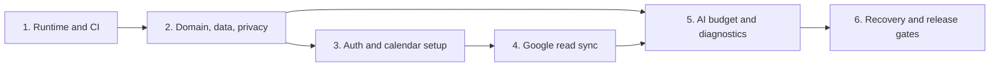

# Vision Phase B Implementation Roadmap

> **For agentic workers:** REQUIRED SUB-SKILL: Use superpowers:subagent-driven-development (recommended) or superpowers:executing-plans to implement this plan task-by-task. Steps use checkbox (`- [ ]`) syntax for tracking.

**Goal:** Build and release Vision's trusted, single-user cloud data foundation without enabling production event-level calendar writes.

**Architecture:** One TypeScript repository deploys a React/Vite single-page application and Hono API to Cloudflare Workers. Neon PostgreSQL is authoritative; R2, Queues, scheduled Workers, Google Calendar, and OpenAI are reached only through narrow adapters, while pure domain code owns policy and validation.

**Tech Stack:** TypeScript, React, Vite, Hono, Cloudflare Workers/R2/Queues, Neon PostgreSQL, Drizzle ORM, Zod, Workers Web Crypto, Google OAuth and Calendar API, OpenAI Responses API through Cloudflare AI Gateway, Vitest, Workers test pool, Playwright, pnpm, Wrangler, GitHub Actions.

## Global Constraints

- Version 1 serves June74 only and permits only the configured Google account.
- Create or connect exactly one Google secondary calendar named `Vision`, only after exact confirmation.
- Keep `school`, `work`, and `personal` as Vision-only categories; never encode them into Google labels or extended properties.
- Keep PostgreSQL authoritative; any future native graph is derived and rebuildable.
- Keep protected calendar content, notes, uploads, OAuth tokens, and retained AI content encrypted before storage.
- Keep planning-safe timestamps, durations, domain state, provider identity, lifecycle, and opaque IDs queryable.
- Retain deleted encrypted content for 30 days, then purge it permanently.
- Use Google push notifications for the fast path and a scheduled 15-minute incremental repair.
- Treat duplicate jobs as normal, commit sync tokens only after all pages succeed, and rebuild only the Google projection after `410 Gone`.
- Treat model output, uploads, pasted text, and provider descriptions as untrusted data with no authority.
- Route AI through a provider-neutral interface and deterministic validators.
- Warn at $8.00 AI spend, reduce optional work at $9.00, and block new AI requests at $9.50 while core calendar functions continue.
- Keep the entire single-user managed-services pilot near or below $20 monthly.
- Phase B may create the Vision calendar during setup, but must not enable event create, update, move, cancel, or delete.
- Do not report external success until the resulting provider state has been verified.
- Never log decrypted protected fields, credentials, tokens, keys, or raw queue payloads.
- Use strict TypeScript, reviewed SQL migrations, Zod at external boundaries, test-driven development, and small commits.

---

## Plan suite

Execute the following plans in order. Each milestone ends in a working, reviewable system and must pass its own exit gate before the next begins.

| Order | Plan | Working deliverable | Exit gate |
|---|---|---|---|
| 1 | [Runtime and CI](2026-07-22-phase-b-01-runtime-and-ci.md) | Local and preview Worker serves the React shell and health API | Format, type check, unit, Worker, build, and smoke checks pass |
| 2 | [Domain, data, and privacy](2026-07-22-phase-b-02-domain-data-privacy.md) | Canonical graph records, encryption, categorization, lifecycle, and audit rules | Migrations apply; protected sentinel scan is clean; rule tests pass |
| 3 | [Authentication and calendar setup](2026-07-22-phase-b-03-auth-calendar-setup.md) | June74 can sign in and explicitly create or connect the Vision calendar | Wrong-account denial and exact-confirmation paths pass end to end |
| 4 | [Google read synchronization](2026-07-22-phase-b-04-google-read-sync.md) | Vision mirrors Google events near real time and repairs missed signals | Duplicate, missed-notification, revoked-access, and `410` cases pass |
| 5 | [AI budget and diagnostics](2026-07-22-phase-b-05-ai-budget-diagnostics.md) | Safe categorization proposals, spending stops, health states, and diagnostic UI | Privacy, injection, budget, fallback, and browser tests pass |
| 6 | [Recovery and release gates](2026-07-22-phase-b-06-recovery-release.md) | Encrypted backups, restore drill, purge, observability, and production gate | Every Phase B completion gate has fresh evidence |

## Dependency flow

## Review protocol

For every task in every plan:

1. Start from a clean worktree on a `codex/` branch created for that milestone.
2. Write the named failing test and run the exact focused command.
3. Implement only the code needed for that task's contract.
4. Run the focused test, then the milestone verification command.
5. Inspect `git diff --check`, staged file names, and the staged diff.
6. Commit with the task's specified message.
7. Stop for review if an external service behaves differently from the recorded contract; update the design or plan before improvising a new product rule.

## Environment provisioning boundary

Repository work may create code, migrations, tests, and documented setup commands. Creating billable Cloudflare, Neon, Google Cloud, or OpenAI resources; accepting OAuth consent; adding production secrets; and deploying production require explicit user approval at the step where the external state changes.

Use these environment names consistently:

- `local`: mocked providers and local Worker runtime.
- `preview`: isolated Cloudflare preview plus disposable Neon branch and Google test calendar.
- `production`: June74's allowlisted account and confirmed `Vision` calendar.

No live test may use the user's primary Google calendar or production Vision calendar.

## Phase B final evidence packet

The release plan must produce `docs/operations/phase-b-evidence.md` containing:

- Commit and deployed Worker version.
- Migration identifiers and schema verification output.
- Commands and results for format, type checking, unit, Worker, contract, integration, and end-to-end tests.
- Wrong-account and exact-confirmation evidence.
- Normal sync latency sample and the deliberate missed-notification repair result.
- Duplicate delivery, invalid token, revoked authorization, stale version, and uncertain-outcome results.
- Protected sentinel scan across database, logs, queue fixtures, and audit records.
- Backup object checksum and restore-drill result.
- Current Cloudflare, Neon, R2, Google API, and AI usage/cost snapshot.
- Confirmation that event-level Google writes remain disabled.

## Completion

Phase B is not complete merely because the application deploys. It is complete only after Plan 6 maps fresh evidence to every completion gate in the approved specification and the user approves promotion from the read foundation into Phase C.
