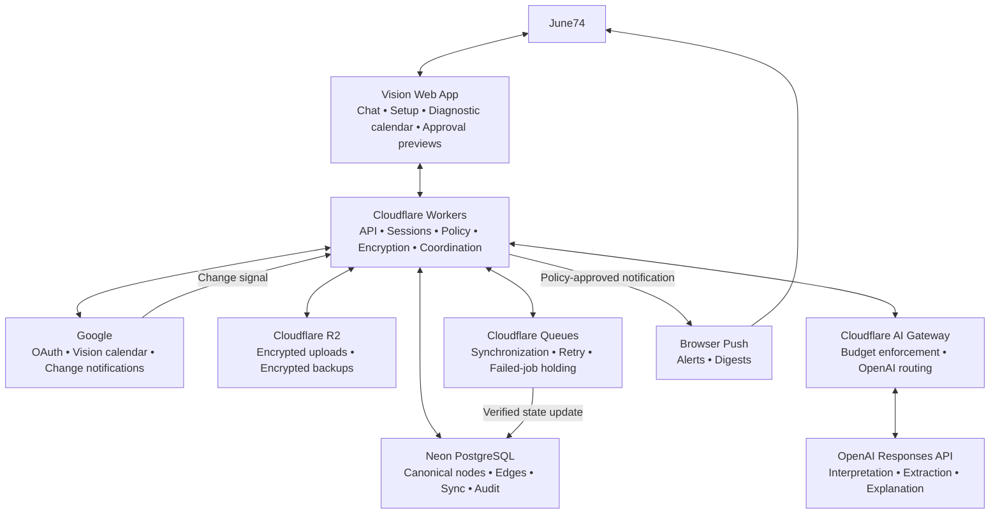

# Vision Phase B Data Foundation Design

**Status:** Approved

**Approved by:** June74

**Written-spec approval date:** 2026-07-22

**Project:** Vision AI Secretary

## Purpose

Phase B builds the trusted cloud data foundation for Vision's single-user private pilot. It establishes identity, one Google Calendar, near-real-time read synchronization, the canonical PostgreSQL knowledge graph, privacy and encryption boundaries, provider adapters, audit history, recovery, cost controls, and a small diagnostic interface.

Phase B does not implement the polished Today dashboard, conversational scheduling, full event editing, recommendations, or guarded autonomy. Those product experiences build on this foundation in Phases C through E.

## Approved constraints

- Version 1 serves June74 only.
- Vision is a cloud-hosted web application.
- The deployment uses managed services with a total private-pilot ceiling of approximately $20 per month.
- Google sign-in is the only Version 1 sign-in method and is restricted to one approved Google account.
- Vision creates one Google secondary calendar named `Vision` after an exact user confirmation.
- School, work, and personal are internal Vision categories, not three Google calendars and not visible Google event labels.
- Vision automatically categorizes clear items, visibly marks inferred categories, and asks when the category is ambiguous or mixed.
- Google Calendar remains the external calendar source of truth, but ordinary calendar management will occur through Vision beginning in Phase C.
- Connected-calendar writes always show an exact preview and require confirmation in Version 1.
- Google changes should normally appear in Vision near real time.
- Sensitive content receives application-level encryption before storage.
- Deleted content remains encrypted and recoverable for 30 days, then is purged.
- Uploaded files are copied only when the user explicitly imports them. Calendar attachments and linked files are not copied automatically.
- A managed AI API may receive the minimum context required for a request. Credentials and unrelated private content are excluded.
- Phase B uses a PostgreSQL graph model and preserves a later migration path to a derived native-graph projection.

## Architecture decision

### Selected: PostgreSQL graph model

Vision stores its bounded, typed knowledge graph in managed PostgreSQL. A common node registry holds the shared envelope for every product object, typed tables hold type-specific fields, and a governed edge registry holds allowed relationships.

PostgreSQL is the sole transactional source of truth for Vision state. It provides the strongest fit for synchronization checkpoints, privacy state, approvals, audit records, recovery, and low operational cost.

### Deferred: native graph projection

If later organization-scale workloads require deep or unpredictable graph traversals, Vision may project selected PostgreSQL nodes and edges into a native graph database. That projection will be derived and rebuildable; it will never become the authority for permissions, calendar writes, or audit state.

### Rejected for Version 1

1. **Native graph database plus a separate transaction ledger:** strong graph traversal, but two authoritative services would increase cost, security surface, and consistency failure modes before the single-user pilot benefits from them.
2. **PostgreSQL plus an immediate graph projection:** preserves transactional authority and graph queries, but adds projection lag, reconciliation, and a second paid service without a Version 1 requirement.

## System boundary



Cloudflare Workers is the only coordinating application runtime. The browser never receives database credentials, storage credentials, Google refresh tokens, provider API keys, or encryption keys. The AI provider never receives direct access to Google Calendar or Vision storage.

## Managed service allocation

| Responsibility | Managed service | Private-pilot expectation |
|---|---|---|
| Web assets, API, webhooks, scheduled work | Cloudflare Workers | Paid plan starting at $5 monthly |
| Transactional source of truth | Neon PostgreSQL | Begin within free usage with scale-to-zero and maximum autoscaling limits |
| Explicit uploads and encrypted backups | Cloudflare R2 | Begin within the 10 GB monthly free storage allowance |
| AI routing and spend enforcement | Cloudflare AI Gateway | Route OpenAI requests and enforce the AI sub-budget |
| Calendar and identity | Google OAuth and Calendar API | Standard single-user usage within configured quotas |

The application maintains a separate usage ledger and warning thresholds. Provider dashboards and quota settings provide additional controls, but Vision does not assume every provider budget is a perfect hard cap.

References: [Cloudflare Workers pricing](https://developers.cloudflare.com/workers/platform/pricing/), [Cloudflare R2 pricing](https://developers.cloudflare.com/r2/pricing/), [Neon pricing](https://neon.com/pricing), and [Google Calendar API usage limits](https://developers.google.com/workspace/calendar/api/guides/quota).

## PostgreSQL knowledge-graph model

### Common node registry

Every product object receives a `nodes` record with:

- Stable Vision ID.
- Closed node type.
- Owner ID.
- Source system and source ID when applicable.
- Domain: `school`, `work`, `personal`, or `unresolved`.
- Domain state: `confirmed`, `inferred`, or `unresolved`.
- Privacy level.
- Provenance.
- Lifecycle state.
- Created, updated, valid-from, and valid-to timestamps.
- Monotonic version.
- Model confidence only when the value is inferred.

### Typed tables

Type-specific tables reference the common node ID. Phase B establishes schemas for the Version 1 objects approved in the product contract: events, tasks, notes, commitments, recommendations, preferences, policies, audit events, people, calendars, source artifacts, and alert episodes.

Provider-backed events store planning-safe fields separately from encrypted content. Google IDs, event versions, recurrence identity, and synchronization state remain explicit columns rather than opaque JSON blobs.

### Governed edge registry

The `edges` table permits only registered relationship types and allowed source and destination node types. Each edge stores:

- Stable edge ID.
- Source and destination node IDs.
- Registered relationship type.
- Origin: provider, user, system, or model.
- Evidence and provenance.
- Confidence for inferred relationships.
- Lifecycle: proposed, confirmed, rejected, or retracted.
- Privacy level.
- Validity interval and version.

Unknown relationship types cannot participate in permissions, scheduling, alerts, or automatic actions. Edges add context but never transfer access, lower privacy, or grant authority.

## Domain categorization contract

The exact precedence rule is:

> Explicit user choice takes priority, followed by a confirmed source association, followed by an AI-inferred category. An inference can never lower privacy or authorize sharing.

1. An explicit category supplied or corrected by June74 is saved as `confirmed`.
2. Content derived from a confirmed categorized source inherits that domain unless the new content explicitly conflicts with it.
3. Clear model-supported categorization is saved as `inferred` and displayed with an easy correction control.
4. Ambiguous, mixed, or materially consequential categorization remains `unresolved`, and Vision asks one focused question.
5. A model-inferred label cannot expose content, authorize a Google write, change an autonomy setting, or create an external disclosure.
6. Corrections are recorded as user-confirmed facts and become labeled feedback for later evaluation.

The categories exist only inside Vision. Google receives no school, work, or personal label, title prefix, or category color from Vision Version 1.

## Encryption and privacy

### Planning-safe searchable fields

PostgreSQL may query the following fields directly:

- Start and end timestamps.
- Time zone, duration, recurrence identity, and busy status.
- Deadline, status, flexibility, and priority facts.
- Domain and domain state.
- Privacy level.
- Opaque Vision and provider identifiers.
- Lifecycle, version, and synchronization metadata.

These fields remain covered by provider encryption at rest and transport encryption.

### Application-encrypted fields

Vision encrypts these before storage:

- Event titles and descriptions.
- Note bodies and chat source text.
- Attendee names, addresses, and responses.
- Locations and meeting links.
- Uploaded-document text and metadata that reveals content.
- Google refresh tokens.
- Retained AI inputs and outputs.

Each protected value stores ciphertext, a unique nonce, authenticated metadata, and a key version. Each user and privacy domain receives a separate data key. Those data keys are themselves encrypted by a root wrapping key stored as a Worker secret. Key rotation re-encrypts data keys before bulk content re-encryption is considered.

The database alone must not be sufficient to decrypt sensitive fields. Logs, metrics, queue payloads, browser state, and audit events must not contain plaintext protected content.

## Deletion and backup lifecycle

1. A confirmed delete moves a Vision-managed object into an encrypted recoverable state.
2. The object remains recoverable for 30 days.
3. At expiration, protected content, derived searchable material, and active edges are permanently purged or retracted.
4. Non-sensitive audit facts may retain actor, action type, time, policy decision, outcome, and opaque record identity.
5. Daily encrypted database exports are stored in R2 with a separate backup key.
6. Backups expire after 30 days, ensuring deleted content cannot persist indefinitely through backup retention.
7. A restore test must pass before the private pilot begins.

Source Google events are never deleted merely because a Vision-local annotation or derived node expires. Google event deletion is a separate connected-system action requiring exact confirmation.

## Google identity and calendar setup

Version 1 uses Google OAuth authorization-code sign-in with Proof Key for Code Exchange, secure server sessions, and an allowlist containing only June74's approved Google subject and email.

Onboarding will:

1. Authenticate the approved account.
2. Request the minimum Calendar scopes needed for the current Phase B operation.
3. Discover whether the approved `Vision` secondary calendar already exists.
4. Show an exact creation preview if it does not exist.
5. Create it only after confirmation, with the authenticated user as owner.
6. Encrypt and store the refresh token.
7. Run the initial synchronization and register a change-notification channel.

Phase B does not modify the user's primary calendar. Google documents authenticated creation of secondary calendars in its [Calendars insert reference](https://developers.google.com/workspace/calendar/api/v3/reference/calendars/insert).

## Synchronization design

### Incoming Google changes

1. Google sends a signed channel notification to an HTTPS Worker endpoint.
2. The endpoint verifies channel identity and token, adds an opaque synchronization job, and returns promptly.
3. A queue consumer performs incremental synchronization using the last committed Google sync token.
4. Every changed or deleted event is translated into Vision's provider-neutral event form.
5. A database transaction updates provider state, nodes, edges, invalidated derived records, audit facts, and the next sync token.
6. The next sync token is committed only after every page of the change set succeeds.

Push notifications are the near-real-time path. A scheduled incremental repair runs every 15 minutes to recover dropped notifications without keeping the database continuously awake. Notification channels are renewed before their recorded expiration.

If Google returns `410 Gone` for an invalid sync token, Vision rebuilds only the Google-backed projection, then reconciles Vision-only categories, annotations, and relationships by deterministic provider identity. It does not destroy Vision-only records.

References: [Google push notifications](https://developers.google.com/workspace/calendar/api/guides/push) and [incremental synchronization](https://developers.google.com/workspace/calendar/api/guides/sync).

### Outgoing Google changes

Phase C will use the following already-approved write contract:

1. Build a proposed change from the authenticated request.
2. Retrieve the latest Google event and its version.
3. Apply deterministic permission, privacy, conflict, and hard-constraint checks.
4. Show the exact before-and-after preview, attendee effect, recurrence scope, and notification behavior.
5. Require confirmation.
6. Retrieve or validate the Google version again immediately before writing.
7. Stop and invalidate approval if material state changed.
8. Perform the idempotent write.
9. Retrieve the resulting Google state.
10. Commit the result and audit event, then report verified success.

Every operation receives a unique opaque operation ID. Created events store the opaque Vision event and operation IDs in Google private extended properties. No domain or sensitive content is encoded there. If a response is lost, Vision searches for the operation before retrying to prevent duplication.

Vision never reports a connected-calendar change as completed until it verifies the resulting Google state. Google supports private event properties and version-aware event updates. References: [extended properties](https://developers.google.com/workspace/calendar/api/guides/extended-properties) and [event updates](https://developers.google.com/workspace/calendar/api/v3/reference/events/update).

## AI boundary and model routing

Vision uses the OpenAI Responses API through a provider-neutral `AiProvider` interface and Cloudflare AI Gateway.

### Model roles

- `gpt-5.6-luna` handles routine categorization, extraction, compact summaries, and alert wording.
- `gpt-5.6-terra` handles complex multi-constraint planning only when the task class or evaluation result justifies the additional cost.
- The flagship model is excluded from the default private-pilot route.
- Model IDs, reasoning effort, maximum output, and routing thresholds are deployment configuration validated against the frozen evaluation set.

The AI receives a request-specific context packet containing only permitted nodes and fields. It never receives database access, Google credentials, encryption keys, or an unrestricted tool that can write to a connected system.

The model returns a Structured Output containing interpreted intent, extracted facts, evidence references, ambiguity flags, domain suggestion, and proposed actions. Deterministic Vision code validates the schema and independently evaluates privacy, permission, conflict, freshness, alert, and budget rules. The model output is a proposal, not authority.

References: [OpenAI model guidance](https://developers.openai.com/api/docs/guides/latest-model), [GPT-5.6 Luna](https://developers.openai.com/api/docs/models/gpt-5.6-luna), [GPT-5.6 Terra](https://developers.openai.com/api/docs/models/gpt-5.6-terra), and [Structured Outputs](https://developers.openai.com/api/docs/guides/structured-outputs).

## AI spending contract

The private-pilot AI sub-budget is bounded as follows:

- At $8.00 in the monthly window, Vision warns the user and routes all noncritical eligible work to Luna.
- At $9.00, Vision stops optional rewriting and expanded explanations.
- At $9.50, both the application ledger and AI Gateway block new AI requests until the window resets.
- The remaining $0.50 absorbs one in-flight request or small estimation differences.
- Only one AI request may begin at a time in the single-user pilot.

Cloudflare AI Gateway tracks modeled cost and blocks requests after its spend rule is reached. Because its accounting is eventually consistent, Vision also estimates before dispatch and records actual token usage afterward. If AI is unavailable or blocked, direct calendar editing, synchronization, conflict detection, deterministic alerts, and template briefings continue.

Reference: [Cloudflare AI Gateway spend limits](https://developers.cloudflare.com/ai-gateway/features/spend-limits/).

## Recommendation and alert boundaries

The scheduling engine filters permissions, privacy, fixed events, deadlines, travel feasibility, and protected time before ranking any option. AI explains approved feasible candidates but does not decide feasibility.

The deterministic alert engine decides eligibility, quiet-hours behavior, episode deduplication, channel mirroring, acknowledgment, and the single allowed deadline-proximity escalation. AI may summarize an eligible alert but cannot make an alert eligible. Template alerts and briefings remain available when AI is unavailable.

Uploaded documents, pasted text, provider descriptions, and model output are untrusted data. Instructions found inside them cannot grant permission, change autonomy settings, authorize communication, delete records, or bypass privacy filters.

## Failure behavior

| Failure | Required behavior |
|---|---|
| Dropped Google notification | Recover through the 15-minute incremental repair. |
| Duplicate notification or queue delivery | Deduplicate by stable job and operation identity. |
| Google rate limit or transient server error | Retry with exponential backoff and jitter; surface prolonged delay. |
| Revoked Google authorization | Stop sync and writes; show `Disconnected` and request reconnection. |
| Stale event after approval | Stop, show the material difference, and require a new approval. |
| Lost response after a Google write | Retrieve by provider identity or operation ID before retrying. |
| Repeatedly failing background job | Move to a failed-job queue and show `Action required`. |
| AI timeout, refusal, invalid schema, or budget stop | Perform no side effect; use a manual or template fallback. |
| Database unavailable | Do not acknowledge durable completion; retry safe reads and queue retryable work. |
| R2 unavailable during upload | Keep no partial database success; show retryable failure. |
| Unknown write outcome | Show `Verification pending`, reconcile, and never claim success prematurely. |
| Recurring-event edit | Require an explicit occurrence-or-series scope in the preview. |

## Technology stack

| Area | Selection |
|---|---|
| Language | TypeScript with strict compiler settings |
| Client | React single-page application built with Vite |
| API | Hono on Cloudflare Workers |
| Database | Neon PostgreSQL |
| Database access | Drizzle ORM plus reviewed SQL migrations |
| Runtime validation | Zod |
| File storage | Cloudflare R2 |
| Jobs | Cloudflare Queues and scheduled Workers |
| AI | OpenAI Responses API through Cloudflare AI Gateway |
| Encryption | Workers Web Crypto authenticated encryption |
| Tests | Vitest, Cloudflare Workers test pool, and Playwright |
| Deployment | Wrangler through GitHub Actions |
| Package manager | pnpm with a committed lockfile |

Cloudflare documents a combined React, Vite, static-assets, and Worker API deployment. Hono supports Worker fetch and scheduled handlers, and Neon's serverless driver supports edge access. References: [Cloudflare React and Vite](https://developers.cloudflare.com/workers/framework-guides/web-apps/react/), [Cloudflare Vite plugin](https://developers.cloudflare.com/workers/vite-plugin/), [Hono on Workers](https://hono.dev/docs/getting-started/cloudflare-workers), [Neon serverless driver](https://neon.com/docs/serverless/serverless-driver), and [Drizzle with Neon](https://orm.drizzle.team/docs/connect-neon).

## Repository structure

```text
Vision/
├── src/
│   ├── client/
│   │   ├── auth/
│   │   ├── calendar/
│   │   ├── setup/
│   │   └── status/
│   ├── server/
│   │   ├── auth/
│   │   ├── api/
│   │   ├── webhooks/
│   │   └── sessions/
│   ├── domain/
│   │   ├── autonomy/
│   │   ├── categorization/
│   │   ├── privacy/
│   │   ├── scheduling/
│   │   └── alerts/
│   ├── data/
│   ├── crypto/
│   ├── integrations/
│   │   ├── google-calendar/
│   │   └── openai/
│   ├── jobs/
│   ├── audit/
│   └── worker.ts
├── migrations/
├── tests/
│   ├── unit/
│   ├── contract/
│   ├── integration/
│   ├── e2e/
│   └── fixtures/
├── docs/
│   ├── architecture/
│   └── operations/
├── package.json
├── pnpm-lock.yaml
├── tsconfig.json
├── vite.config.ts
└── wrangler.jsonc
```

`domain` contains pure Vision rules and imports no React, Cloudflare, Google, OpenAI, or database implementation. `integrations` translates provider data into domain types. `data` persists domain types without defining product policy. `crypto` is the only component that handles protected-field encryption. `audit` accepts privacy-safe audit facts. `server` authenticates and coordinates requests. `jobs` implements retryable background work. `client` renders state and collects exact approvals.

The single deployable application avoids an unnecessary monorepo in Version 1. These module boundaries allow shared domain and API packages to be extracted when native desktop or mobile clients begin.

## Documentation and code-comment contract

Vision maintains two separate, synchronized references for the implementation:

1. `docs/reference/simple/` explains every production source file, every named production function or component, and each meaningful architectural folder in concise plain language.
2. `docs/reference/technical/` documents the same items in depth, including signatures, inputs, outputs, side effects, dependencies, failure behavior, privacy or security constraints, and covering tests.

The reference trees mirror the production source path. A meaningful source folder receives `_folder.md` in both trees. Every production source file that supports comments begins with an appropriate short module documentation comment, and every named TypeScript production function, component, or class method receives a concise JSDoc contract. Inline comments explain non-obvious reasons, invariants, privacy boundaries, retry behavior, or provider limitations; they do not narrate obvious syntax.

An automated documentation-coverage check must fail when a production file or named function lacks either reference layer. Documentation updates are part of the same task and commit as the code they describe.

## Deployment and operational design

The private pilot uses one permanent production environment. GitHub Actions runs formatting, type checking, unit tests, Worker-runtime tests, contract tests, migration checks, and secret scanning. Successful changes produce a temporary preview. Production deployment requires manual approval.

Temporary Cloudflare previews and Neon branches are deleted after their test purpose ends. Secrets are configured through managed secret storage and never committed. Destructive database migrations require an encrypted backup and an explicit recovery procedure.

Operational logs contain opaque IDs, action types, timing, outcome, error category, sync delay, queue retry count, and AI usage. They exclude decrypted titles, descriptions, notes, attendee details, file content, tokens, and keys.

Vision exposes four operational states: `Healthy`, `Delayed`, `Action required`, and `Disconnected`. It monitors the last successful sync, oldest queued job, failed-job count, Google authorization, AI spend, alert delivery, database usage, and object storage usage.

## Verification strategy

### Test layers

1. Unit tests cover pure domain, privacy, categorization, budget, alert, and encryption rules.
2. Contract tests exercise Vision adapters against recorded and simulated Google, OpenAI, Neon, queue, and R2 responses.
3. Integration tests use isolated managed resources and a temporary Google test calendar.
4. End-to-end tests cover authenticated setup, calendar creation, synchronization, recovery, and the diagnostic interface.
5. The approved Phase A scenario pack validates school, work, personal, and cross-domain behavior as later product phases activate those paths.

Automated tests use simulated Google responses by default. Live Google tests use a temporary test calendar with conspicuous test titles and verified cleanup. They never use the user's primary calendar or production Vision calendar.

### Required Phase B cases

- Only the approved Google account can establish a production session.
- Vision calendar creation requires exact confirmation.
- Explicit categories override inherited or inferred categories.
- Ambiguous categorization remains unresolved.
- AI inference cannot lower privacy or authorize an action.
- Protected test strings do not appear in raw database rows, logs, queue payloads, or audit records.
- Duplicate notifications and queue jobs do not create duplicate events or nodes.
- A deliberately missed notification is repaired.
- An invalid sync token rebuilds provider state without losing Vision-only metadata.
- Revoked Google authorization stops sync and writes.
- A stale provider version invalidates approval.
- An uncertain write outcome remains pending until reconciled.
- Expired recoverable content and backups are purged.
- AI budget exhaustion leaves non-AI calendar functions operational.
- Uploaded prompt-injection instructions create no permission or side effect.
- Backup restoration reconstructs the expected encrypted database state.

## Phase B implementation boundary

Phase B implements:

- Cloudflare-native project scaffolding and CI.
- Google-only authentication and production-account allowlisting.
- Exact-confirmation creation or connection of one Google calendar named `Vision`.
- Initial, push-triggered, and scheduled repair synchronization.
- Provider-neutral events and the PostgreSQL node-and-edge foundation.
- Internal domain categorization state and correction support.
- Application encryption, key versioning, and protected-token storage.
- Audit and operational status foundations.
- Queue retry, deduplication, and failed-job handling.
- Encrypted backups and a restore drill.
- A small setup, synchronized-event, and health diagnostic interface.
- Cost measurement and enforced AI sub-budget infrastructure.

Phase B does not enable event-level create, update, move, cancel, or delete operations in production. The approved write pipeline is implemented and enabled in Phase C after the read foundation and recovery gates pass.

## Phase B completion gates

Phase B is complete only when:

- Google access is restricted to June74's approved account.
- The Vision calendar is created or connected only after confirmation.
- Calendar changes normally synchronize near real time.
- A deliberately missed notification is repaired.
- PostgreSQL preserves provider identity, domain, privacy, provenance, and governed relationships.
- Protected test content is absent from raw storage and logs.
- Duplicate, stale, revoked-access, invalid-token, and uncertain-outcome tests pass.
- A backup restore succeeds.
- Operational status accurately exposes delayed, failed, and disconnected states.
- Measured infrastructure usage remains compatible with the $20 monthly ceiling.
- No event-level Google write is enabled beyond the approved calendar-creation setup.

## Future evolution

- Phase C enables the approved preview, confirmation, version-check, idempotent-write, verification, audit, and recovery pipeline for calendar events.
- Phase D adds deterministic candidate generation and ranking with AI explanations.
- Phase E expands guarded Vision-only autonomy without weakening always-confirm connected writes in Version 1.
- A later graph projection may be added for deep organization-scale queries while PostgreSQL remains authoritative.
- Later desktop and mobile clients consume the same authenticated API and domain contracts.
- Later privacy-safe organization calendars use consented availability projections and never copy private source content.
